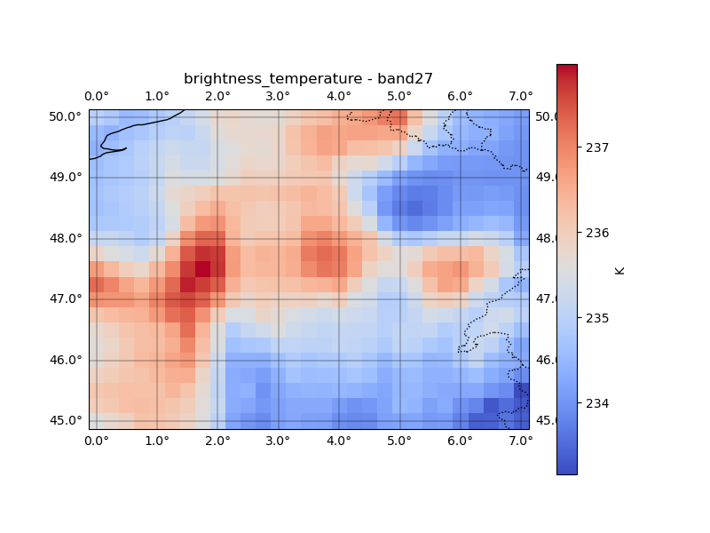

<p align="center">
  
</p>

# RTTOVpy

**RTTOVpy** is a Python application for preparing RTTOV input profiles
from **WRF** model outputs or **ERA5** reanalysis data, executing the
**RTTOV** forward model, post-processing the results into georeferenced
NetCDF files and figures, and optionally verifying the simulated
satellite observations against real satellite data.

RTTOVpy automates the complete workflow from atmospheric model output to
satellite-simulated products while keeping the original RTTOV
executables unchanged.

------------------------------------------------------------------------

## Features

-   Support for both **WRF** and **ERA5** workflows
-   Automatic satellite viewing geometry from TLE data
-   WRF-Chem dust/aerosol support
-   Post-processing to NetCDF and publication-quality maps
-   Verification against real satellite observations

------------------------------------------------------------------------

## Installation

Prerequisites:

-   RTTOV (version 14 recommended)
-   RTTOV coefficient files
-   Python 3 with the required scientific packages

Clone the repository:

``` bash
git clone https://github.com/anikfal/rttovpy.git
cd rttovpy
```

------------------------------------------------------------------------

## Quick Start

### ERA5 example

``` bash
cd era5_input_data
python rttovpy.py
./run_era5_example_fwd.sh ARCH=gfortran

# Enable postprocessing in namelist_era5.yaml
python rttovpy.py
```

The figure below shows the simulated brightness temperature for **MODIS Terra
Band 27** generated by RTTOVpy from ERA5 atmospheric fields.

<p align="center">
  
</p>

### WRF example

``` bash
cd wrf_data
python rttovpy.py
./run_wrf_example_fwd.sh ARCH=gfortran

# Enable postprocessing in namelist_wrf.yaml
python rttovpy.py
```

------------------------------------------------------------------------

## Documentation

The complete user guide, tutorials, and examples are available at:

**https://rttovpy.readthedocs.io/**

<!-- Current documentation includes:

-   ERA5 MODIS example
-   Configuration examples
-   Satellite channel inspection
-   Historical TLE support
-   RTTOV execution workflow
-   Post-processing

Additional WRF examples and advanced tutorials will be added in future
releases. -->

------------------------------------------------------------------------

## Repository Structure

``` text
rttovpy/
├── docs/
├── era5_input_data/
├── wrf_data/
└── README.md
```

------------------------------------------------------------------------

## Citation

If RTTOVpy contributes to your research, please cite the forthcoming
software publication. Citation information will be added here once
available.

------------------------------------------------------------------------

## License

RTTOVpy is released under the MIT License. See the [LICENSE](LICENSE) file for details.

------------------------------------------------------------------------

## Author

**Amirhossein Nikfal**

Website: https://www.amirnikfal.com/
