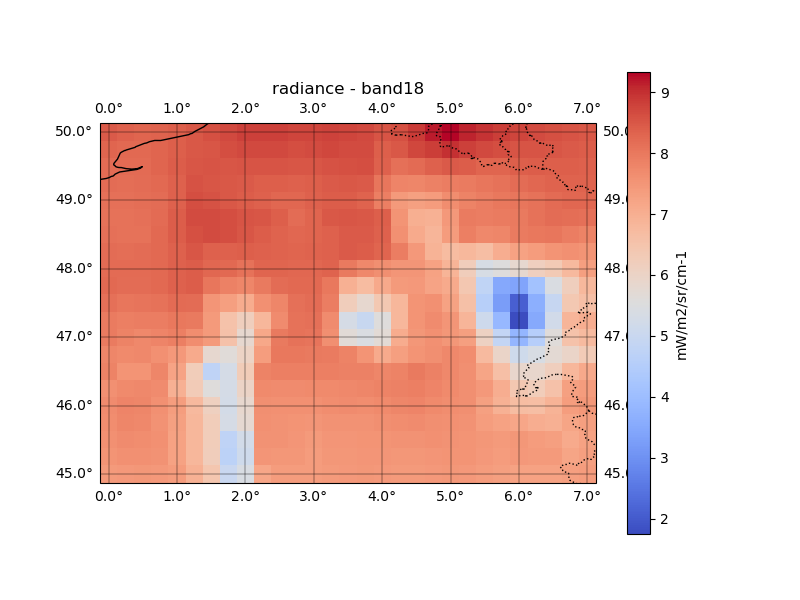
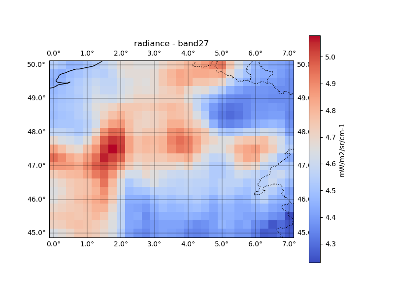

ERA5 Example: Simulating MODIS Observations
===========================================

This example demonstrates how to simulate MODIS observations from ERA5
atmospheric fields using **RTTOVpy**.

Example Configuration
---------------------

The simulation is configured through ``namelist_era5.yaml``. The following
configuration is used throughout this example.

.. code-block:: yaml

    rttov_version: 14
    rttov_installation_path: /home/anikfal/WRFDA/rttov14
    rttov_coefficient_file_path: /home/anikfal/WRFDA/rttov14/rtcoef_rttov14/rttov13pred54L/rtcoef_eos_1_modis_o3co2.dat

    solar_simulation:
      enabled: false

    time_of_simulation:
      year: 2022
      month: 4
      day: 12
      hour: 12

    area_of_simulation:
      domain_name: modis
      north_latitude: 50
      south_latitude: 45
      west_longitude: 0
      east_longitude: 7

    satellite_information:
      sat_name_index: 2
      sat_channel_list: [18, 27]
      sat_channel_names: [band18, band27]

      user_defined_sat_position:
        enabled: true
        sat_latitude: 47.5
        sat_longitude: 3.5

      historical_tle:
        enabled: false
        space-track.org_username: username1234
        space-track.org_password: password1234

    postprocessing:
      enabled: false
      postprocessing_directory_suffix: rttov_outputs_postprocessing
      image_plot_all_bands: true

      RGB_plot_brightness_temperature:
        enabled: false
        Red: band4 + band7
        Green: band9
        Blue: band9 - band4

The most important settings are summarized below:

``rttov_coefficient_file_path``
    Specifies the RTTOV coefficient file corresponding to the satellite sensor
    being simulated.

``time_of_simulation``
    Defines the ERA5 analysis time used to generate the RTTOV input profiles.

``area_of_simulation``
    Defines the geographical domain over which ERA5 data are downloaded and
    RTTOV simulations are performed.

``sat_name_index``
    Selects the satellite platform from ``satellite_names.yaml``.

``sat_channel_list``
    Lists the RTTOV channel numbers to simulate. The available channels can be
    inspected using the ``--wavelength`` option described in the previous
    section.

``sat_channel_names``
    User-defined names assigned to the simulated channels. These names are used
    by RTTOVpy when generating the output files.

``user_defined_sat_position``
    Uses the specified satellite latitude and longitude to compute the viewing
    geometry. This option is useful for user-defined or idealized satellite
    locations.

``historical_tle``
    When enabled, RTTOVpy retrieves historical Two-Line Element (TLE) data from
    Space-Track to compute the satellite position at the simulation time. This
    option is generally required for non-geostationary satellites when accurate
    viewing geometry is needed.

``postprocessing``
    Controls the generation of NetCDF files and image products from the RTTOV
    outputs. In this example, post-processing is disabled and only the RTTOV
    input profiles are generated.

Inspecting the Sensor Spectral Channels
---------------------------------------

Before selecting the channels to simulate, it is often useful to inspect the
spectral information contained in an RTTOV coefficient file. RTTOVpy provides
the ``--wavelength`` option for this purpose.

For example, to list the channels available for the MODIS sensor::

    python rttovpy.py --wavelength \
        /home/anikfal/WRFDA/rttov14/rtcoef_rttov14/rttov13pred54L/rtcoef_eos_1_modis_o3co2.dat

This command prints the RTTOV channel number together with its central
wavenumber, wavelength, and whether the channel is a solar channel.

Example output::

    Channel | Wavenumber (cm⁻¹) | Wavelength (µm) | Solar
    ------------------------------------------------------------
          1 |        15497.035 |          0.645 | True
          2 |        11683.870 |          0.856 | True
          3 |        21481.534 |          0.466 | True
          4 |        18065.706 |          0.554 | True
          ...
         31 |          908.273 |         11.010 | False
         32 |          831.523 |         12.026 | False
         33 |          748.347 |         13.363 | False
         34 |          730.924 |         13.681 | False
         35 |          718.926 |         13.910 | False
         36 |          704.576 |         14.193 | False

The channel numbers reported by this command are used in the
``sat_channel_list`` option of ``namelist_era5.yaml``. The corresponding
``sat_channel_names`` entries are user-defined labels used by RTTOVpy for
naming the generated outputs.

Preparing the RTTOV Input Profiles
----------------------------------

Change to the ``era5_input_data`` directory and execute RTTOVpy::

    cd era5_input_data
    python rttovpy.py

RTTOVpy automatically prepares the input data required by the RTTOV forward
model. During this stage, the application performs the following tasks:

* Downloads the required ERA5 atmospheric pressure-level variables.
* Downloads the required ERA5 surface variables.
* Extracts the atmospheric and surface parameters required by RTTOV.
* Determines the position of the Terra satellite at the simulation time.
* Computes the satellite viewing geometry (satellite zenith angle, satellite
  azimuth angle, satellite elevation, solar zenith angle, and solar azimuth
  angle) for every ERA5 grid point according to the MODIS Terra sensor
  specifications.
* Generates one RTTOV input profile for each ERA5 grid point within the
  selected simulation domain.
* Creates a shell script named ``run_era5_example_fwd.sh`` for executing the
  RTTOV forward simulations.

A typical execution is shown below::

    $ python rttovpy.py

    Postprocessing is disabled. Running to make the RTTOV profile files ..

    Channels requiring solar: [18]
    WARNING: solar_simulation is disabled, but solar channels detected.
     solar_simulation has been automatically set to true.

    Making profile files for RTTOV ..

    ERA5 files not found. Downloading...
      Downloading ERA5 data on the atmospheric pressure levels ..
      ...
      Downloading ERA5 surface data ..
      ...

    Using CelesTrak for EOS-Terra

    Profile files have been created for RTTOV. Total profiles: 609 ..

    Creating final application shell script
    (run_era5_example_fwd.sh) for RTTOV forward simulation with ERA5 input
    data...

After the program finishes successfully, the working directory contains the
downloaded ERA5 datasets, the generated RTTOV profile files, and the shell
script required to execute the RTTOV forward model::

    era5_input_data/
    ├── era5data_pressure_levels_2022_4_12_modis.grib
    ├── era5data_surface_level_2022_4_12_modis.grib
    ├── modis_profiles/
    ├── modules/
    ├── modules14plus/
    ├── namelist_era5.yaml
    ├── rttovpy.py
    ├── run_era5_example_fwd.sh
    └── satellite_names.yaml

The ``modis_profiles`` directory contains one RTTOV input profile for each
ERA5 grid point. Each profile contains the atmospheric state, surface
properties, and the viewing geometry of the MODIS Terra instrument for that
location and simulation time. These profile files are used directly by the
RTTOV forward model in the next step.

Using Historical TLE Data from Space-Track
------------------------------------------

By default, RTTOVpy retrieves recent Two-Line Element (TLE) data from
CelesTrak to determine the satellite position and viewing geometry.
For historical simulations, or when higher orbital accuracy is required,
it is recommended to retrieve historical TLE data from Space-Track.

To use this feature, register for a free account at
https://www.space-track.org/auth/login.

Then enable the ``historical_tle`` section in
``namelist_era5.yaml`` and provide your Space-Track credentials:

.. code-block:: yaml

    historical_tle:
      enabled: true
      space-track.org_username: your_username
      space-track.org_password: your_password

When enabled, RTTOVpy retrieves the historical TLE corresponding to the
simulation time from Space-Track and uses it to compute the satellite
position and viewing geometry for every ERA5 grid point. This is
particularly recommended for polar-orbiting satellites when reproducing
past observations with the highest possible geometric accuracy.

Generated RTTOV Input Profiles
------------------------------

The generated directory (``modis_profiles``) contains the input profiles that
are read by the RTTOV forward model. One profile file is generated for each
ERA5 grid point within the selected simulation domain.

For example::

    modis_profiles/
    ├── prof-000001.dat
    ├── prof-000002.dat
    ├── prof-000003.dat
    ├── ...
    └── prof-000609.dat

Each profile file contains the atmospheric state and surface information
required by RTTOV to simulate the satellite observations. This includes

* atmospheric pressure levels,
* temperature profile,
* water vapour profile,
* near-surface meteorological variables,
* skin temperature,
* surface type,
* surface elevation,
* geographic coordinates,
* satellite viewing geometry,
* solar geometry, and
* cloud parameters.

A simplified excerpt of a generated profile file is shown below.

.. code-block:: text

    ! Pressure levels (hPa)

    0.012899
    0.020004
    ...
    1006.645000

    ! Temperature profile (K)

    194.507645
    204.812973
    ...
    284.773590

    ! Water vapour profile (kg/kg)

    0.000010
    0.000010
    ...
    0.006735

    ...

    ! Elevation (km), latitude and longitude (degrees)

       -0.002    50.000    0.000

    ! Satellite and solar viewing geometry

       4.007    135.950    48.781    179.696

These files follow the input format expected by the RTTOV example forward
programs and can therefore be supplied directly to the RTTOV forward model
without any manual modification.

Running the RTTOV Forward Model
-------------------------------

After the ERA5-based RTTOV input profiles have been generated, the RTTOV
forward model can be executed using the shell script created by RTTOVpy::

    ./run_era5_example_fwd.sh ARCH=gfortran

The ``ARCH`` argument must match the compiler architecture used for the RTTOV
installation. In this example, RTTOV was compiled using ``gfortran``.

The script runs the RTTOV forward model separately for each generated profile
file in ``modis_profiles``. During execution, RTTOVpy reports the satellite
zenith angle and the profile file currently being simulated.

A shortened example of the standard output is shown below::

    Satellite zenith angle: 31.522
    Simulating based on /home/anikfal/training/rttovpy/era5_input_data/modis_profiles/prof-000001.dat

    Test forward

    enter path of coefficient file
    enter path of file containing profile data
    enter number of profiles
    enter number of profile pressure half-levels
    turn on solar simulations? (0=no, 1=yes)
    enter number of channels to simulate per profile
    enter space-separated channel list
    enter number of threads to use

    2026/07/08  21:26:31  rttov_check_reg_limits.F90
        Input water vapour profile exceeds upper coef limit (profile number =        1)

    Satellite zenith angle: 30.663
    Simulating based on /home/anikfal/training/rttovpy/era5_input_data/modis_profiles/prof-000002.dat

    Test forward
    ...

The warning from ``rttov_check_reg_limits.F90`` indicates that one or more
input profile values are outside the regression limits of the selected RTTOV
coefficient file. In this example, the simulation continues and RTTOV still
produces output files.

Generated RTTOV Output Files
^^^^^^^^^^^^^^^^^^^^^^^^^^^^

After the forward simulations finish, RTTOVpy creates the output directory
``modis_outputs``. This directory contains one RTTOV output file for each input
profile::

    modis_outputs/
    ├── output_example_fwd.dat_prof-000001.dat
    ├── output_example_fwd.dat_prof-000002.dat
    ├── output_example_fwd.dat_prof-000003.dat
    ├── ...
    └── output_example_fwd.dat_prof-000609.dat

Each output file contains the RTTOV configuration, the input profile interpreted
by RTTOV, and the calculated satellite quantities for the selected channels.

A shortened example of one output file is shown below::

    -----------------
    Instrument modis
    -----------------

    Profile            1

    Viewing conditions
      zenangle         31.522
      azangle         135.888
      sunzenangle      48.781
      sunazangle      179.696
      elevation        -0.002
      latitude         50.000
      longitude         0.000

    Surface variables
      number of surfaces    1
      surface fraction (implicit)     1.0000

    Skin parameters
      surface type 0=land, 1=sea, 2=sea-ice       0
      water type  0=fresh water, 1=ocean water    1
      radiative skin temperature (K)             0.283460E+03

    Near-surface air parameters
      2m temperature (K)           0.285044E+03
      2m water vapour (kg/kg)      0.740000E-02
      10m wind U component (m/s)   0.333600E+01
      10m wind V component (m/s)   0.619460E+01

    CHANNELS PROCESSED FOR SAT eos        1
           18      27

    CALCULATED BRIGHTNESS TEMPERATURES (K):
         0.00  234.99

    CALCULATED SATELLITE REFLECTANCES (BRF):
        0.554   0.000

    CALCULATED RADIANCES (mW/m2/sr/cm-1):
         8.46    4.54

    CALCULATED SURFACE EMISSIVITIES:
        0.000   0.980

For this example, channels ``18`` and ``27`` are processed. Since channel
``18`` is a solar channel, RTTOV also reports the calculated satellite
reflectance. Channel ``27`` is a thermal infrared channel, so the corresponding
brightness temperature and radiance are the main simulated quantities.

Post-processing the RTTOV Outputs
---------------------------------

After the RTTOV forward model has been executed for all ERA5 grid points, the
individual RTTOV output files can be converted to NetCDF files and visualized
as spatial plots.

To enable post-processing, set ``postprocessing.enabled`` to ``true`` in
``namelist_era5.yaml``:

.. code-block:: yaml

    postprocessing:
      enabled: true
      postprocessing_directory_suffix: rttov_outputs_postprocessing
      image_plot_all_bands: true

      RGB_plot_brightness_temperature:
        enabled: false
        Red: band4 + band7
        Green: band9
        Blue: band9 - band4

Then run RTTOVpy again::

    python rttovpy.py

A typical post-processing run is shown below::

    Postprocessing ...
    Converting the RTTOV output within the (modis_outputs) directory to NetCDF files ..
    Extracting the RTTOV outputs and storing them in arrays ..
    Storing extracted values in NetCDF files ..
    Storing brightness_temperature into NetCDF
    Storing radiance into NetCDF
    Storing overcast_radiances into NetCDF
    Storing transmittance into NetCDF
    Storing emissivities into NetCDF

    Looking for the RTTOV NetCDF outputs in modis_rttov_outputs_postprocessing ..
    Plotting band18 of modis_rttov_outputs_postprocessing/brightness_temperature.nc
    Plotting band27 of modis_rttov_outputs_postprocessing/brightness_temperature.nc
    Plotting band18 of modis_rttov_outputs_postprocessing/radiance.nc
    Plotting band27 of modis_rttov_outputs_postprocessing/radiance.nc
    ...

The post-processing step creates a directory named
``modis_rttov_outputs_postprocessing``. The prefix ``modis`` comes from
``area_of_simulation.domain_name`` in the namelist.

Example output files are::

    modis_rttov_outputs_postprocessing/
    ├── brightness_temperature.nc
    ├── brightness_temperature_band18.png
    ├── brightness_temperature_band27.png
    ├── radiance.nc
    ├── radiance_band18.png
    ├── radiance_band27.png
    ├── overcast_radiances.nc
    ├── overcast_radiances_band18.png
    ├── overcast_radiances_band27.png
    ├── transmittance.nc
    ├── transmittance_band18.png
    ├── transmittance_band27.png
    ├── emissivities.nc
    ├── emissivities_band18.png
    └── emissivities_band27.png

The generated NetCDF files store the RTTOV outputs on the ERA5 grid, while the
PNG files provide quick-look visualizations for each simulated channel.

For example, the simulated brightness temperature for MODIS band 27 is saved as

.. code-block:: text

    modis_rttov_outputs_postprocessing/brightness_temperature_band27.png

.. image:: brightness_temperature_band27.png
   :alt: Simulated MODIS band 27 brightness temperature from ERA5 using RTTOVpy
   :align: center
   :width: 99%

This figure shows the spatial distribution of the simulated brightness
temperature for MODIS band 27 over the selected ERA5 simulation domain.

The Modis band 18 is empty, as this band is a solar channel with less than 3 micrometers wavelength. Brightness
temperature is not defined for solar channels, so the corresponding output is zero.

The radiance for band 18 is saved as

.. code-block:: text

    modis_rttov_outputs_postprocessing/radiance_band18.png

and the radiance for band 27 is saved as

.. code-block:: text

    modis_rttov_outputs_postprocessing/radiance_band27.png

All pictures were generated using the NetCDF outputs of the RTTOV simulations. 
The NetCDF files can also be used by the user for further analysis.