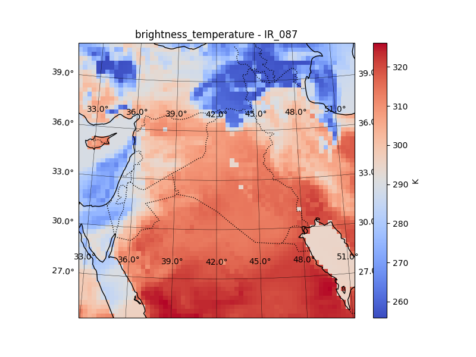
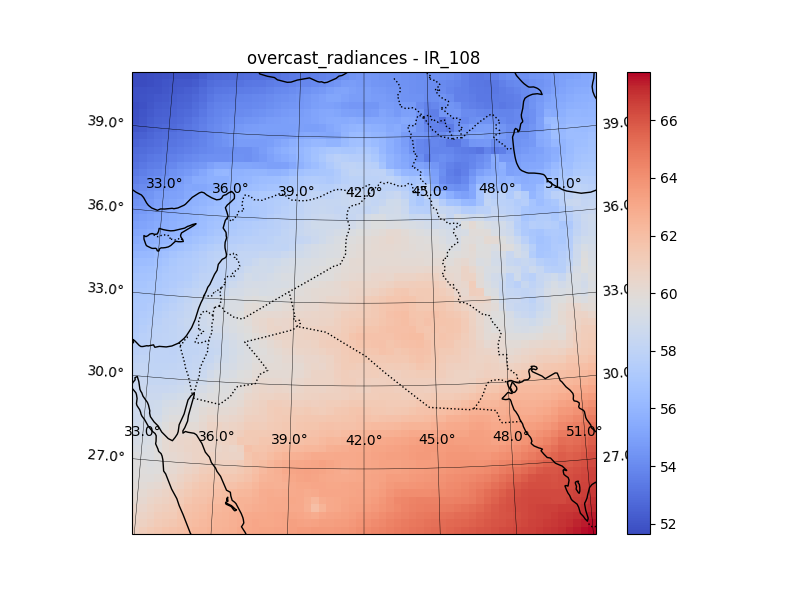
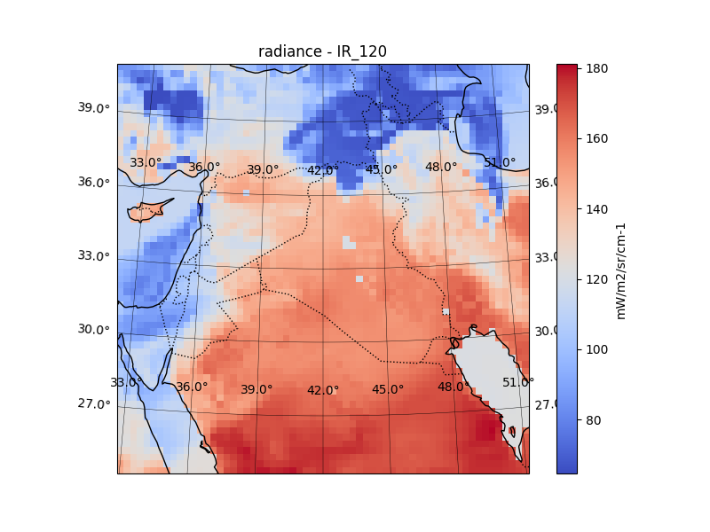
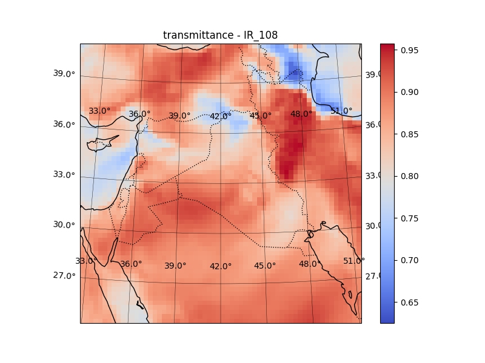
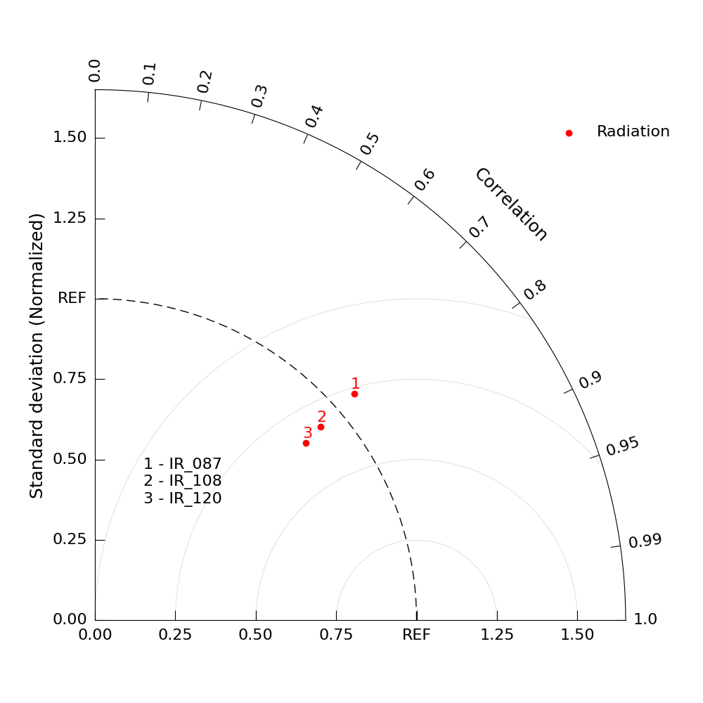

WRF Example: MSG SEVIRI (Geostationary Orbit)
=============================================

This example demonstrates how to run RTTOVpy using a WRF model output file as
input and simulate MSG SEVIRI radiances or brightness temperatures with RTTOV.

Unlike the previous NOAA-20 VIIRS example, which uses a low Earth orbit (LEO)
satellite, this example uses the geostationary Meteosat-9 platform carrying the
SEVIRI instrument. Because Meteosat-9 is geostationary, RTTOVpy automatically
uses the satellite's nominal longitude rather than retrieving a two-line
element (TLE) orbit.

Example configuration
---------------------

The complete configuration file used in this example is shown below.

.. code-block:: yaml

   ... complete namelist_msg.yaml ...

Running RTTOVpy
---------------

From the directory containing ``rttovpy.py`` and ``namelist_wrf.yaml``, run:

.. code-block:: console

   python rttovpy.py

RTTOVpy creates a new directory containing one RTTOV profile file for each WRF
grid point and generates the shell script used to execute the RTTOV forward
model.

A shortened excerpt of the terminal output is shown below:

.. code-block:: console

   Directory wrfout_d01_2022-05-15_00_kuwait_msg_inputs/ has been created to store profile datafiles.

   Meteosat-9 is geostationary. Using its nominal position (lon=45.5) instead of TLE.

   Simulation with user defined satellite position:

   Creating profile data for the grid point jj: 1 ii: 1
   Creating profile data for the grid point jj: 1 ii: 2
   Creating profile data for the grid point jj: 1 ii: 3
   ...
   Creating profile data for the grid point jj: 62 ii: 61
   Creating profile data for the grid point jj: 62 ii: 62

   ==================================================================
   Making the shellscript application for the RTTOV forward model ...
   The file run_wrf_example_fwd.sh has been made successfully.

Generated files
---------------

The generated RTTOV profile files are stored in

.. code-block:: text

   wrfout_d01_2022-05-15_00_kuwait_msg_inputs/

One profile is created for each WRF grid point.

.. code-block:: console

   $ ls wrfout_d01_2022-05-15_00_kuwait_msg_inputs/ | head

   prof-000001.dat
   prof-000002.dat
   prof-000003.dat
   prof-000004.dat
   prof-000005.dat
   prof-000006.dat
   prof-000007.dat
   prof-000008.dat
   prof-000009.dat
   prof-000010.dat

Each profile file contains the atmospheric state and viewing geometry required
by RTTOV. This includes the pressure, temperature and water-vapour profiles,
surface variables, satellite and solar viewing geometry, and cloud
information.

An excerpt from the first profile file is shown below.

.. code-block:: text

   ! Pressure levels (hPa)
   50.012212830752716
   54.5680854483848
   59.48489566410961
   ...
   993.80640625

   ! Temperature profile (K)
   206.16922
   204.01598
   ...
   311.52875

   ! Water vapour profile (kg/kg)
   0.00001
   0.00001
   ...
   0.00511

   ...

   ! Sat. zenith and azimuth angles, solar zenith and azimuth angles (degrees)

   19.89 34.09 58.13 -92.77

At this stage, the WRF atmospheric fields have been converted into
RTTOV-compatible input profiles, and the generated
``run_wrf_example_fwd.sh`` script is ready to execute the RTTOV forward model.

Running the RTTOV forward model
-------------------------------

After the input profiles and shell script have been generated, run the RTTOV
forward simulations with:

.. code-block:: console

   ./run_wrf_example_fwd.sh ARCH=gfortran

The shell script executes RTTOV separately for each of the 3,844 WRF grid-point
profiles.

A shortened excerpt of the terminal output is shown below:

.. code-block:: console

   Simulating based on /home/anikfal/training/rttovpy/wrf_data/wrfout_d01_2022-05-15_00_kuwait_msg_inputs/prof-000001.dat

   Test forward

   enter path of coefficient file
   enter path of file containing profile data
   enter number of profiles
   enter number of profile pressure half-levels
   turn on solar simulations? (0=no, 1=yes)
   enter number of channels to simulate per profile
   enter space-separated channel list
   enter number of threads to use

   2026/07/10  13:43:30  rttov_check_reg_limits.F90
       Input water vapour profile exceeds upper coef limit (profile number =        1)
   2026/07/10  13:43:30  Limit         =     7.6890   13.5306
   2026/07/10  13:43:30  Layer p (hPa) =    61.4771   74.4427
   2026/07/10  13:43:30  Value         =    16.0778   16.0778

   Simulating based on /home/anikfal/training/rttovpy/wrf_data/wrfout_d01_2022-05-15_00_kuwait_msg_inputs/prof-000002.dat

   Test forward

   enter path of coefficient file
   enter path of file containing profile data
   enter number of profiles
   enter number of profile pressure half-levels
   turn on solar simulations? (0=no, 1=yes)
   enter number of channels to simulate per profile
   enter space-separated channel list
   enter number of threads to use

   2026/07/10  13:43:30  rttov_check_reg_limits.F90
       Input water vapour profile exceeds upper coef limit (profile number =        1)
   2026/07/10  13:43:30  Limit         =     7.6890   13.5306
   2026/07/10  13:43:30  Layer p (hPa) =    61.4771   74.4427
   2026/07/10  13:43:30  Value         =    16.0778   16.0778

   ...

The profile-checking message indicates that the input water-vapour value exceeds
the upper coefficient limit in the reported pressure layer. In this example,
RTTOV continues the forward simulation and produces the output files.

Generated RTTOV output files
----------------------------

The results are written to:

.. code-block:: text

   wrfout_d01_2022-05-15_00_kuwait_msg_outputs/

The directory contains one RTTOV output file for each WRF grid point. For
example:

.. code-block:: text

   wrfout_d01_2022-05-15_00_kuwait_msg_outputs/output_example_fwd.dat_prof-000001.dat

Each file contains the RTTOV configuration, atmospheric and surface input
profiles, viewing geometry, and the simulated quantities for the selected
SEVIRI channels.

For the first WRF grid point, RTTOV processes channels 7, 9, and 10,
corresponding to the SEVIRI bands ``IR_087``, ``IR_108``, and ``IR_120``:

.. code-block:: console

   CHANNELS PROCESSED FOR SAT msg        2
           7       9      10

   CALCULATED BRIGHTNESS TEMPERATURES (K):
      310.43  312.60  309.70

   CALCULATED SATELLITE REFLECTANCES (BRF):
       0.000   0.000   0.000

   CALCULATED RADIANCES (mW/m2/sr/cm-1):
       88.51  134.27  146.15

   CALCULATED OVERCAST RADIANCES:
       34.03   60.81   74.06

   CALCULATED SURFACE TO SPACE TRANSMITTANCE:
      0.7711  0.8491  0.7732

   CALCULATED SURFACE EMISSIVITIES:
       0.980   0.980   0.980

   CALCULATED SURFACE BRDF:
       0.000   0.000   0.000

The reflectance and BRDF values are zero because all three selected SEVIRI bands
are thermal infrared channels. Their principal simulated quantities are
therefore brightness temperature and thermal radiance.

The output also contains the atmospheric level-to-space transmittance for each
selected channel:

.. code-block:: console

   Level to space transmittances for channels
             7       9      10
     1  1.0000  1.0000  1.0000
     2  0.9883  0.9984  0.9992
     3  0.9878  0.9983  0.9992
     4  0.9873  0.9982  0.9991
     5  0.9867  0.9981  0.9990
     ...
    41  0.7841  0.8608  0.7889
    42  0.7800  0.8571  0.7840
    43  0.7765  0.8541  0.7799
    44  0.7736  0.8514  0.7763
    45  0.7711  0.8491  0.7732

At this stage, the RTTOV forward simulation has been completed for every WRF
grid point. The individual text outputs can next be converted into gridded
NetCDF files and quick-look maps using the RTTOVpy postprocessing workflow.

Postprocessing the RTTOV outputs
--------------------------------

After the RTTOV forward simulations have finished, enable the
``postprocessing`` block in ``namelist_wrf.yaml``:

.. code-block:: yaml

   postprocessing:
     enabled: true

Then run RTTOVpy again:

.. code-block:: console

   python rttovpy.py

RTTOVpy reads the individual RTTOV text output files, extracts the simulated
variables, and stores them as NetCDF files on the original WRF latitude and
longitude grid.

.. code-block:: console

   Postprocessing ...
   Converting the RTTOV output within the (wrfout_d01_2022-05-15_00_kuwait_msg_postprocessing) directory to NetCDF files ..
   Extracting the RTTOV outputs and storing them in arrays ..
   Storing extracted values in NetCDF files ..
   Storing brightness_temperature into NetCDF
   Storing radiance into NetCDF
   Storing overcast_radiances into NetCDF
   Storing transmittance into NetCDF
   Storing emissivities into NetCDF
   Brightness temperature, Radiance, Overcast radiance, Surface to space transmittance,and emissivities have been stored in NetCDF files

The generated NetCDF files are then used to create map plots for each selected
SEVIRI band.

.. code-block:: console

   Plotting IR_087 of wrfout_d01_2022-05-15_00_kuwait_msg_postprocessing/brightness_temperature.nc
   Plotting IR_108 of wrfout_d01_2022-05-15_00_kuwait_msg_postprocessing/brightness_temperature.nc
   Plotting IR_120 of wrfout_d01_2022-05-15_00_kuwait_msg_postprocessing/brightness_temperature.nc
   ...
   Plotting IR_087 of wrfout_d01_2022-05-15_00_kuwait_msg_postprocessing/emissivities.nc
   Plotting IR_108 of wrfout_d01_2022-05-15_00_kuwait_msg_postprocessing/emissivities.nc
   Plotting IR_120 of wrfout_d01_2022-05-15_00_kuwait_msg_postprocessing/emissivities.nc

Generated postprocessing files
------------------------------

The postprocessing directory contains one NetCDF file for each principal RTTOV
output variable, together with PNG maps for each selected SEVIRI channel.

.. code-block:: console

   $ ls wrfout_d01_2022-05-15_00_kuwait_msg_postprocessing/

   brightness_temperature_IR_087.png
   brightness_temperature_IR_108.png
   brightness_temperature_IR_120.png
   brightness_temperature.nc
   emissivities_IR_087.png
   emissivities_IR_108.png
   emissivities_IR_120.png
   emissivities.nc
   overcast_radiances_IR_087.png
   overcast_radiances_IR_108.png
   overcast_radiances_IR_120.png
   overcast_radiances.nc
   radiance_IR_087.png
   radiance_IR_108.png
   radiance_IR_120.png
   radiance.nc
   transmittance_IR_087.png
   transmittance_IR_108.png
   transmittance_IR_120.png
   transmittance.nc

The NetCDF files contain the RTTOV outputs mapped back onto the WRF grid. They
can be used directly for further analysis, validation, or visualization using
standard scientific tools.

The PNG files provide quick-look maps of the simulated brightness temperature,
radiance, overcast radiance, surface-to-space transmittance, and surface
emissivity fields.

Example output maps
-------------------

Representative output maps generated by RTTOVpy are shown below.

Brightness temperature (IR_087)

Overcast radiance (IR_108)

Radiance (IR_120)

Surface-to-space transmittance (IR_108)

RTTOVpy automatically generates equivalent figures for every simulated channel
and output variable. The corresponding NetCDF files provide the same fields in
a machine-readable format for further scientific analysis.

Verification against MSG SEVIRI observations
--------------------------------------------

RTTOVpy can compare the simulated SEVIRI outputs with corresponding MSG
satellite observations. For this example, the satellite data and accompanying
metadata files are stored in:

.. code-block:: console

   $ ls /home/anikfal/training/data/msg

   EOPMetadata.xml
   manifest.xml
   MSG1-SEVI-MSG15-0100-NA-20220516121241.899000000Z-NA.nat
   MSG1-SEVI-MSG15-0100-NA-20220516121241.899000000Z-NA.zip
   readme.txt

The ``.nat`` file contains the MSG SEVIRI observation data used in the
verification. The remaining metadata, text, and archive files are harmless.
RTTOVpy attempts to inspect the directory contents but processes only the
supported satellite file.

Enable the ``verification`` block in ``namelist_wrf.yaml``:

.. code-block:: yaml

   verification:
     enabled: true
     verification_directory_suffix: msg_verification

     satellite_files_group:
       enabled: true
       satellite_file_directory: /home/anikfal/training/data/msg

     satellite_sensor_id: 53
     taylor_diagram_name: radiation_taylor_diagram_msg

     keep_remapped_satellite_to_wrf_data:
       enabled: true
       remapped_file_name: msg_to_wrf

Because ``satellite_files_group.enabled`` is set to ``true``, RTTOVpy loads the
compatible satellite files found in ``satellite_file_directory`` and ignores
the standalone ``satellite_file_path`` option.

Run RTTOVpy again:

.. code-block:: console

   python rttovpy.py

RTTOVpy loads the MSG SEVIRI observation, processes the selected infrared
bands, and remaps the satellite data onto the WRF grid:

.. code-block:: console

   Loading the satellite files in the group directory ..
   Don't know how to open the following files: {'/home/anikfal/training/data/msg/manifest.xml',
   '/home/anikfal/training/data/msg/MSG1-SEVI-MSG15-0100-NA-20220516121241.899000000Z-NA.zip',
   '/home/anikfal/training/data/msg/readme.txt',
   '/home/anikfal/training/data/msg/EOPMetadata.xml'}

   Verification processing on the satellite Meteosat-8 - band IR_087
   Remapping satellite data on the WRF grid structure ..

   Verification processing on the satellite Meteosat-8 - band IR_108
   Remapping satellite data on the WRF grid structure ..

   Verification processing on the satellite Meteosat-8 - band IR_120
   Remapping satellite data on the WRF grid structure ..

   Storing extracted values in NetCDF files ..

The messages about unsupported files indicate that the XML, text, and ZIP files
are not satellite datasets readable by the selected Satpy reader. They do not
prevent the ``.nat`` observation file from being processed.

Generated verification files
----------------------------

The verification outputs are written to:

.. code-block:: text

   wrfout_d01_2022-05-15_00_kuwait_msg_verification/

The directory contains the remapped satellite data, the statistical summary,
and the Taylor diagram:

.. code-block:: console

   $ ls wrfout_d01_2022-05-15_00_kuwait_msg_verification/

   msg_to_wrf_IR_087.nc
   msg_to_wrf_IR_108.nc
   msg_to_wrf_IR_120.nc
   radiation_taylor_diagram_msg.png
   radiation_taylor_diagram_msg_table.txt

The ``msg_to_wrf_*.nc`` files contain the MSG SEVIRI observations remapped onto
the WRF latitude-longitude grid. These files can be used for additional
analysis or custom visualization.

Verification statistics
-----------------------

The verification metrics for the three SEVIRI infrared bands are stored in
``radiation_taylor_diagram_msg_table.txt``:

.. code-block:: text

                IR_087   IR_108   IR_120
   CV           1.070    0.924    0.857
   RMSE         0.268    0.224    0.205
   Correlation  0.753    0.758    0.766

The correlation coefficients are similar for all three channels and range from
0.753 to 0.766. The lowest RMSE is obtained for ``IR_120``, while the
coefficient-of-variation ratio is closest to one for ``IR_087`` and
``IR_108``.

The statistical comparison is summarized in the generated Taylor diagram:

These results demonstrate the complete geostationary verification workflow in
RTTOVpy: reading MSG SEVIRI observations, remapping them onto the WRF grid, and
quantitatively comparing the observed and simulated infrared radiances.

This completes the WRF–MSG SEVIRI example, including profile generation, RTTOV
forward simulation, postprocessing, and verification against geostationary
satellite observations.