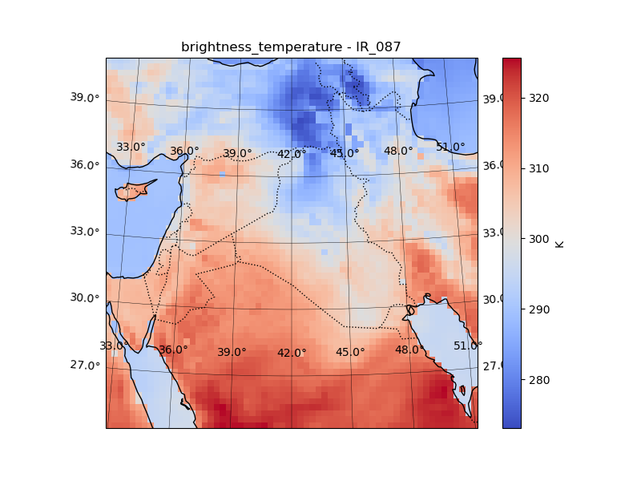
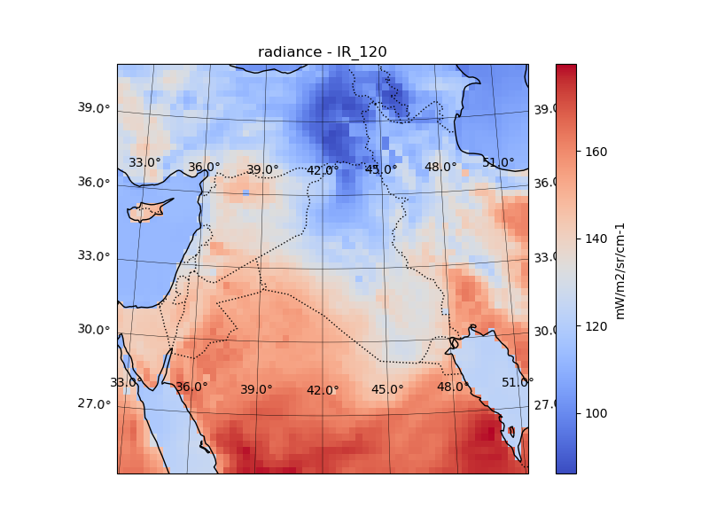
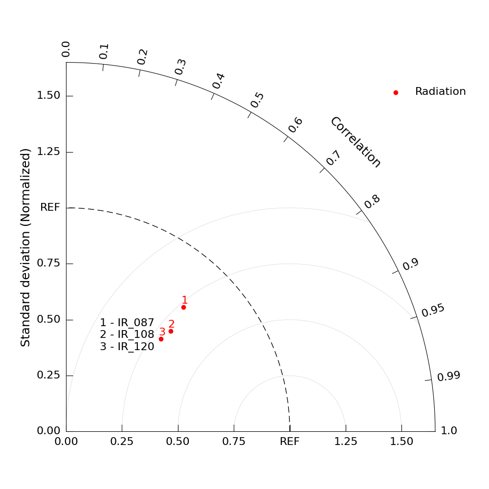

WRF-Chem Dust Example: MSG SEVIRI
=================================

This example demonstrates how to simulate MSG SEVIRI observations from a
WRF-Chem output while including the radiative effects of mineral dust aerosols.

The workflow is similar to the clear-sky MSG SEVIRI example described in
:doc:`wrf_seviri`. However, in this example, RTTOVpy extracts the WRF-Chem dust
profiles and runs RTTOV with aerosol scattering enabled.

The example uses the geostationary Meteosat-9 platform and the SEVIRI thermal
infrared channels ``IR_087``, ``IR_108``, and ``IR_120``.

.. important::

   This example writes files with the same directory and filenames as the
   corresponding clear-sky MSG SEVIRI example. Run the dust simulation in a
   separate working directory or use different directory suffixes if both the
   clear-sky and dust-affected results must be preserved.

Example configuration
---------------------

The complete ``namelist_wrf.yaml`` configuration used in this example is shown
below. The main difference from the clear-sky example is that
``wrfchem_dust_profiles.enabled`` is set to ``true``.

.. code-block:: yaml

   rttov_version: 14
   rttov_installation_path: /home/anikfal/WRFDA/rttov14
   rttov_coefficient_file_path: /home/anikfal/WRFDA/rttov14/rtcoef_rttov14/rttov13pred54L/rtcoef_msg_2_seviri_o3co2.dat

   solar_simulation:
     enabled: true

   wrf_file_path: /home/anikfal/postwrf/zkuwaitoutputs/wrfout_d01_2022-05-15_00_kuwait

   time_of_simulation:
     year: 2022
     month: 5
     day: 16
     hour: 12

   rttov_inputdata_directory_suffix: msg_inputs
   rttov_outputdata_directory_suffix: msg_outputs

   wrfchem_dust_profiles:
     enabled: true
     aerosol_coefficient_file_path: /home/anikfal/WRFDA/rttov14/rtcoef_rttov14/aertable_visir/rttov_aertable_msg_2_seviri_opac.dat

   satellite_information:
     sat_name_index: 23
     sat_channel_list: [7, 9, 10]
     sat_channel_names: [IR_087, IR_108, IR_120]

     user_defined_position:
       enabled: true
       sat_latitude: 38
       sat_longitude: 45

     historical_tle:
       enabled: true
       space-track.org_username: your_username
       space-track.org_password: your_password

   #================================================================================================================
   postprocessing:
     enabled: false
     postprocessing_directory_suffix: msg_postprocessing
     image_plot_all_bands: true

     RGB_plot_brightness_temperature:
       enabled: false
       Red: B5 + B6 + B7
       Green: B5
       Blue: B7

   verification:
     enabled: false
     verification_directory_suffix: msg_verification

     satellite_file_path: /home/anikfal/training/data/landsat8single/LC08_L1TP_168034_20220516_20220524_02_T1_B5.TIF

     satellite_files_group:
       enabled: true
       satellite_file_directory: /home/anikfal/training/data/msg

     satellite_sensor_id: 53
     taylor_diagram_name: radiation_taylor_diagram_msg

     keep_remapped_satellite_to_wrf_data:
       enabled: true
       remapped_file_name: msg_to_wrf

The aerosol optical properties are read from:

.. code-block:: text

   rttov_aertable_msg_2_seviri_opac.dat

The aerosol table must be compatible with the selected satellite instrument and
the aerosol representation used by the WRF-Chem simulation.

Preparing the RTTOV and aerosol profiles
----------------------------------------

Run RTTOVpy from the directory containing ``rttovpy.py`` and
``namelist_wrf.yaml``:

.. code-block:: console

   python rttovpy.py

RTTOVpy extracts the atmospheric, surface, viewing-geometry, and WRF-Chem dust
information required by RTTOV. It creates one input profile for each WRF grid
point.

The clear-sky atmospheric profiles are stored in:

.. code-block:: text

   wrfout_d01_2022-05-15_00_kuwait_msg_inputs/

For this 62 × 62 WRF domain, RTTOVpy prepares 3,844 profiles.

.. code-block:: console

   Directory wrfout_d01_2022-05-15_00_kuwait_msg_inputs/ has been created to store profile datafiles.
   Meteosat-9 is geostationary. Using its nominal position (lon=45.5) instead of TLE.
   Simulation with user defined satellite position:
   Creating profile data for the grid point jj: 1 ii: 1
   Creating profile data for the grid point jj: 1 ii: 2
   Creating profile data for the grid point jj: 1 ii: 3
   ...
   Creating profile data for the grid point jj: 62 ii: 61
   Creating profile data for the grid point jj: 62 ii: 62

   ==================================================================
   Making the shellscript application for the RTTOV forward model ...
   The file run_wrfchem_dust_example_fwd.sh has been made successfully.

The generated shell script for the aerosol-scattering simulation is:

.. code-block:: text

   run_wrfchem_dust_example_fwd.sh

This differs from the clear-sky script, which is named
``run_wrf_example_fwd.sh``.

Running the RTTOV aerosol-scattering simulation
------------------------------------------------

Run the generated shell script with:

.. code-block:: console

   ./run_wrfchem_dust_example_fwd.sh ARCH=gfortran

For each WRF grid point, the script supplies RTTOV with both the atmospheric
profile and the corresponding aerosol profile. It also provides the aerosol
optical-property table configured in ``namelist_wrf.yaml``.

A shortened excerpt of the terminal output is shown below:

.. code-block:: console

   Simulating based on /home/anikfal/training/rttovpy/wrf_data/wrfout_d01_2022-05-15_00_kuwait_msg_inputs/prof-000001.dat

   Test forward

   enter path of coefficient file
   enter path of aertable file
   enter path of file containing (clear-sky) profile data
   enter path of file containing aerosol profile data
   enter number of profiles
   enter number of profile pressure half-levels
   turn on solar simulations? (0=no, 1=yes)
   enter number of channels to simulate per profile
   enter space-separated channel list
   enter number of threads to use

   2026/07/10  14:33:13  rttov_check_reg_limits.F90
       Input water vapour profile exceeds upper coef limit (profile number =        1)
   2026/07/10  14:33:13  Limit         =     7.6890   13.5306
   2026/07/10  14:33:13  Layer p (hPa) =    61.4771   74.4427
   2026/07/10  14:33:13  Value         =    16.0778   16.0778

   Simulating based on /home/anikfal/training/rttovpy/wrf_data/wrfout_d01_2022-05-15_00_kuwait_msg_inputs/prof-000002.dat

   Test forward

   enter path of coefficient file
   enter path of aertable file
   enter path of file containing (clear-sky) profile data
   enter path of file containing aerosol profile data
   enter number of profiles
   enter number of profile pressure half-levels
   turn on solar simulations? (0=no, 1=yes)
   enter number of channels to simulate per profile
   enter space-separated channel list
   enter number of threads to use

   2026/07/10  14:33:13  rttov_check_reg_limits.F90
       Input water vapour profile exceeds upper coef limit (profile number =        1)
   2026/07/10  14:33:13  Limit         =     7.6890   13.5306
   2026/07/10  14:33:13  Layer p (hPa) =    61.4771   74.4427
   2026/07/10  14:33:13  Value         =    16.0778   16.0778

   Simulating based on /home/anikfal/training/rttovpy/wrf_data/wrfout_d01_2022-05-15_00_kuwait_msg_inputs/prof-000003.dat

   Test forward

   ...

The profile-checking message indicates that the water-vapour value exceeds the
upper coefficient limit within the reported pressure layer. RTTOV continues the
simulation and produces the output files.

Generated RTTOV output files
----------------------------

The RTTOV outputs are written to:

.. code-block:: text

   wrfout_d01_2022-05-15_00_kuwait_msg_outputs/

The directory contains one output file per WRF grid point:

.. code-block:: console

   $ ls wrfout_d01_2022-05-15_00_kuwait_msg_outputs/ | head
   output_example_fwd.dat_prof-000001.dat
   output_example_fwd.dat_prof-000002.dat
   output_example_fwd.dat_prof-000003.dat
   output_example_fwd.dat_prof-000004.dat
   output_example_fwd.dat_prof-000005.dat
   output_example_fwd.dat_prof-000006.dat
   output_example_fwd.dat_prof-000007.dat
   output_example_fwd.dat_prof-000008.dat
   output_example_fwd.dat_prof-000009.dat
   output_example_fwd.dat_prof-000010.dat

Although these filenames are the same as in the clear-sky simulation, their
values differ because the radiative effects of the WRF-Chem dust concentrations
are included through RTTOV aerosol scattering.

The simulated quantities include brightness temperature, radiance, overcast
radiance, surface-to-space transmittance, and surface emissivity for SEVIRI
channels 7, 9, and 10.

Postprocessing the dust-affected outputs
----------------------------------------

After the forward simulation has finished, enable the ``postprocessing`` block:

.. code-block:: yaml

   postprocessing:
     enabled: true

Then run RTTOVpy again:

.. code-block:: console

   python rttovpy.py

RTTOVpy reads the individual dust-affected RTTOV output files and maps the
simulated quantities back onto the original WRF latitude-longitude grid.

The extracted fields are stored in NetCDF files, and quick-look maps are
generated for all selected SEVIRI channels.

The postprocessing products are written to:

.. code-block:: text

   wrfout_d01_2022-05-15_00_kuwait_msg_postprocessing/

The generated files are:

.. code-block:: console

   $ ls wrfout_d01_2022-05-15_00_kuwait_msg_postprocessing/

   brightness_temperature_IR_087.png
   brightness_temperature_IR_108.png
   brightness_temperature_IR_120.png
   brightness_temperature.nc
   emissivities_IR_087.png
   emissivities_IR_108.png
   emissivities_IR_120.png
   emissivities.nc
   overcast_radiances_IR_087.png
   overcast_radiances_IR_108.png
   overcast_radiances_IR_120.png
   overcast_radiances.nc
   radiance_IR_087.png
   radiance_IR_108.png
   radiance_IR_120.png
   radiance.nc
   transmittance_IR_087.png
   transmittance_IR_108.png
   transmittance_IR_120.png
   transmittance.nc

The filenames are identical to those generated by the clear-sky MSG example,
but the NetCDF values and maps represent the simulation including WRF-Chem dust
aerosols.

The NetCDF files can be used to quantify the influence of dust on the simulated
SEVIRI radiances and brightness temperatures or to calculate differences
relative to a corresponding clear-sky simulation.

Example dust-affected output maps
---------------------------------

Representative non-empty output maps from the aerosol-scattering simulation
are shown below.

Brightness temperature (IR_087)
~~~~~~~~~~~~~~~~~~~~~~~~~~~~~~~~

Radiance (IR_120)
~~~~~~~~~~~~~~~~~

Verification against MSG SEVIRI observations
--------------------------------------------

To compare the dust-affected RTTOV simulations with the MSG SEVIRI
observations, enable the ``verification`` block:

.. code-block:: yaml

   verification:
     enabled: true

The satellite files are read from:

.. code-block:: text

   /home/anikfal/training/data/msg

The directory contains the native-format SEVIRI observation and accompanying
metadata and archive files:

.. code-block:: console

   $ ls /home/anikfal/training/data/msg

   EOPMetadata.xml
   manifest.xml
   MSG1-SEVI-MSG15-0100-NA-20220516121241.899000000Z-NA.nat
   MSG1-SEVI-MSG15-0100-NA-20220516121241.899000000Z-NA.zip
   readme.txt

The ``.nat`` file contains the satellite observation used for verification.
The unsupported XML, text, and ZIP files do not prevent RTTOVpy from reading
the native SEVIRI dataset.

Run the verification with:

.. code-block:: console

   python rttovpy.py

RTTOVpy extracts the observed ``IR_087``, ``IR_108``, and ``IR_120`` bands,
remaps them onto the WRF grid, and compares them with the corresponding
dust-affected RTTOV simulations.

Generated verification files
----------------------------

The verification outputs are written to:

.. code-block:: text

   wrfout_d01_2022-05-15_00_kuwait_msg_verification/

The directory contains:

.. code-block:: console

   msg_to_wrf_IR_087.nc
   msg_to_wrf_IR_108.nc
   msg_to_wrf_IR_120.nc
   radiation_taylor_diagram_msg.png
   radiation_taylor_diagram_msg_table.txt

The ``msg_to_wrf_*.nc`` files contain the observed MSG SEVIRI data remapped onto
the WRF grid. The text file contains the verification metrics, while the PNG
file presents the same comparison as a Taylor diagram.

Verification statistics
-----------------------

The verification statistics obtained when WRF-Chem dust aerosols are included
are:

.. code-block:: text

                IR_087   IR_108   IR_120
   CV           0.765    0.647    0.593
   RMSE         0.283    0.244    0.230
   Correlation  0.686    0.721    0.716

The correlation coefficients range from 0.686 for ``IR_087`` to 0.721 for
``IR_108``. The lowest RMSE is obtained for ``IR_120``.

Compared with the clear-sky MSG SEVIRI example, the verification metrics differ
because this simulation accounts for the interaction of radiation with the
WRF-Chem dust profiles. The comparison therefore provides a basis for examining
whether including dust improves or degrades agreement with the satellite
observations for the selected case.

The statistical results are summarized in the Taylor diagram:

Comparing clear-sky and dust simulations
----------------------------------------

Because the clear-sky and aerosol-scattering workflows generate files with the
same names, preserve their outputs in separate directories before comparing
them.

For example, different suffixes can be used for the dust simulation:

.. code-block:: yaml

   rttov_inputdata_directory_suffix: msg_dust_inputs
   rttov_outputdata_directory_suffix: msg_dust_outputs

   postprocessing:
     enabled: true
     postprocessing_directory_suffix: msg_dust_postprocessing

   verification:
     enabled: true
     verification_directory_suffix: msg_dust_verification

This allows direct comparison between clear-sky and dust-affected NetCDF
outputs, such as:

.. code-block:: python

   import xarray as xr

   clear = xr.open_dataset(
       "wrfout_d01_2022-05-15_00_kuwait_msg_postprocessing/"
       "brightness_temperature.nc"
   )

   dust = xr.open_dataset(
       "wrfout_d01_2022-05-15_00_kuwait_msg_dust_postprocessing/"
       "brightness_temperature.nc"
   )

   dust_effect = dust - clear

The resulting difference fields represent the simulated impact of WRF-Chem dust
aerosols on the SEVIRI brightness temperatures.

This completes the WRF-Chem dust workflow: extraction of atmospheric and
aerosol profiles, RTTOV aerosol-scattering simulations, postprocessing into
gridded NetCDF and image products, and verification against MSG SEVIRI
observations.