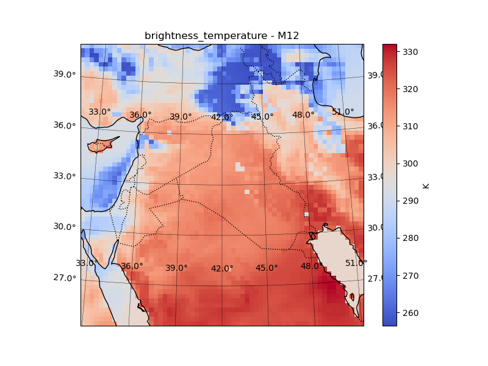
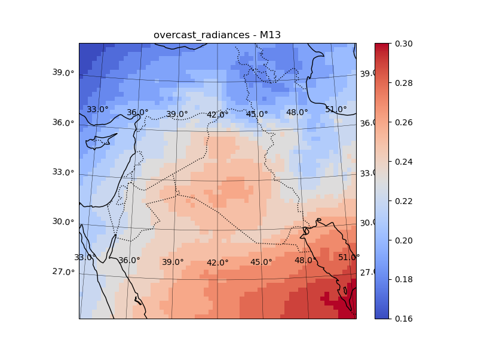
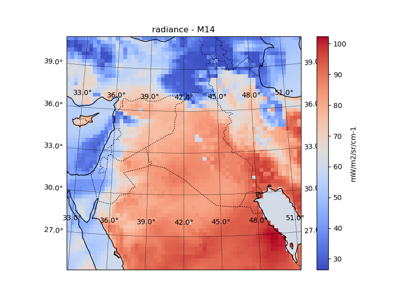
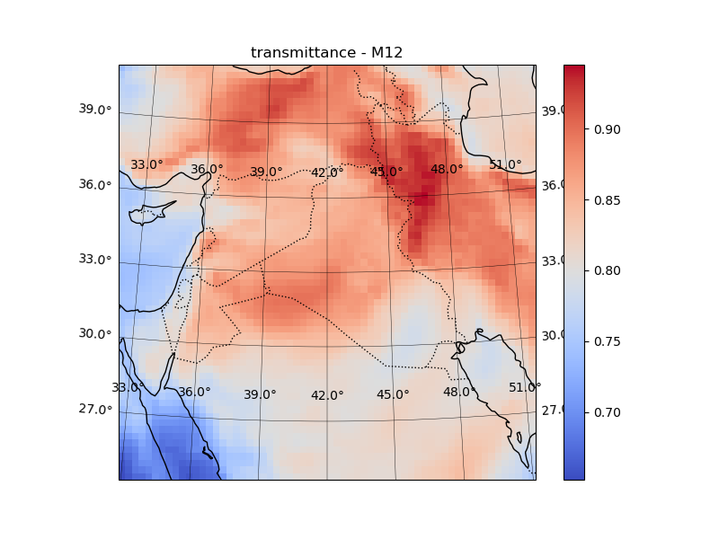
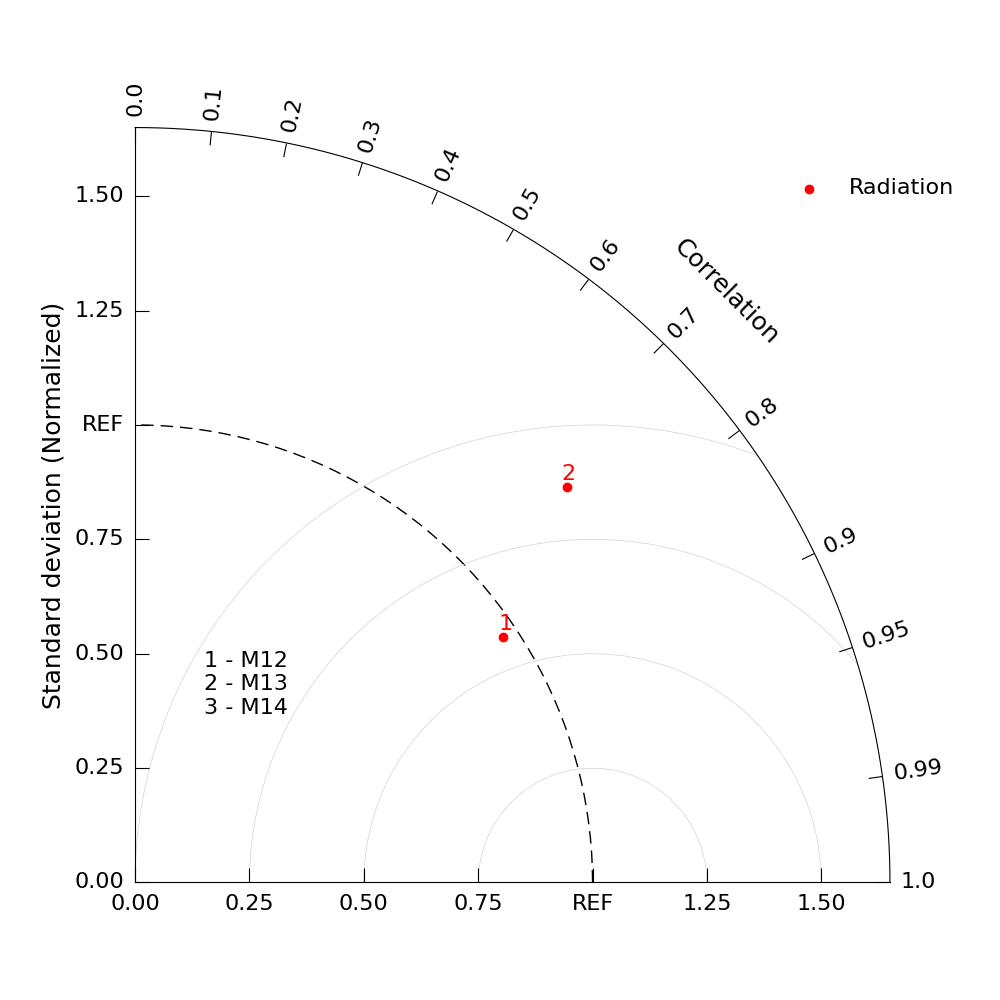

WRF Example: NOAA-20 VIIRS (Low Earth Orbit)
============================================

This example demonstrates how to run RTTOVpy using a WRF model output file as
input and simulate NOAA-20 VIIRS radiances or brightness temperatures with
RTTOV.

The example uses a WRF output file over the Kuwait region and prepares RTTOV
input profiles for selected VIIRS M-bands. In this first step, RTTOVpy reads
the WRF output, extracts the required atmospheric and surface variables, creates
RTTOV profile input files for each WRF grid point, and generates a shell script
for running the RTTOV forward model.

Example configuration
---------------------

The example is controlled by the ``namelist_wrf.yaml`` configuration file. The
main WRF and RTTOV settings are:

.. code-block:: yaml

   rttov_version: 14
   rttov_installation_path: /home/anikfal/WRFDA/rttov14
   rttov_coefficient_file_path: /home/anikfal/WRFDA/rttov14/rtcoef_rttov14/rttov13pred54L/rtcoef_noaa_20_viirs_o3co2.dat

   solar_simulation:
     enabled: true

   wrf_file_path: /home/anikfal/postwrf/zkuwaitoutputs/wrfout_d01_2022-05-15_00_kuwait

   time_of_simulation:
     year: 2022
     month: 5
     day: 16
     hour: 10

   rttov_inputdata_directory_suffix: inputsviirs
   rttov_outputdata_directory_suffix: outputsviirs

Satellite configuration
-----------------------

The NOAA-20 VIIRS sensor is selected through the RTTOV coefficient file and the
satellite index in ``satellite_information``. In this example, RTTOV channels
17, 18, and 19 are selected, corresponding to VIIRS bands ``M12``, ``M13``, and
``M14``.

.. code-block:: yaml

   satellite_information:
     sat_name_index: 20
     sat_channel_list: [17, 18, 19]
     sat_channel_names: [M12, M13, M14]
     user_defined_position:
       enabled: true
       sat_latitude: 38
       sat_longitude: 45
     historical_tle:
       enabled: true
       space-track.org_username: your_username
       space-track.org_password: your_password

Since the selected channel list includes a solar channel, solar simulation is
enabled. RTTOVpy reports this at runtime:

.. code-block:: console

   Channels requiring solar: [17]

Running RTTOVpy
---------------

From the directory containing ``rttovpy.py`` and ``namelist_wrf.yaml``, run:

.. code-block:: console

   python rttovpy.py

RTTOVpy then creates a new input directory using the WRF filename and the
configured suffix:

.. code-block:: console

   Directory wrfout_d01_2022-05-15_00_kuwait_inputsviirs/ has been created to store profile datafiles.

For this example, a user-defined satellite position is used:

.. code-block:: console

   Simulation with user defined satellite position:

RTTOVpy creates one profile file for each WRF grid point. In this case, the WRF
domain contains 62 × 62 grid points, resulting in 3,844 RTTOV profile files.

.. code-block:: console

   Creating profile data for the grid point jj: 1 ii: 1
   Creating profile data for the grid point jj: 1 ii: 2
   Creating profile data for the grid point jj: 1 ii: 3
   ...
   Creating profile data for the grid point jj: 62 ii: 60
   Creating profile data for the grid point jj: 62 ii: 61
   Creating profile data for the grid point jj: 62 ii: 62

After all profile files are created, RTTOVpy generates the shell script used to
run the RTTOV forward model:

.. code-block:: console

   ==================================================================
   Making the shellscript application for the RTTOV forward model ...
   The file run_wrf_example_fwd.sh has been made successfully.

Generated files
---------------

After this step, the main generated outputs are the RTTOV input profile
directory and the forward-model shell script.

.. code-block:: console

   $ ls wrfout_d01_2022-05-15_00_kuwait_inputsviirs/ | head
   prof-000001.dat
   prof-000002.dat
   prof-000003.dat
   prof-000004.dat
   prof-000005.dat
   prof-000006.dat
   prof-000007.dat
   prof-000008.dat
   prof-000009.dat
   prof-000010.dat

.. code-block:: console

   $ ls run_wrf_example_fwd.sh
   run_wrf_example_fwd.sh

At this stage, the WRF fields have been converted into RTTOV-compatible profile
input files, and the example is ready for running the RTTOV forward simulation.

Running the RTTOV forward model
-------------------------------

After the WRF profile files and the forward-model shell script have been
created, run the RTTOV forward simulation with:

.. code-block:: console

   ./run_wrf_example_fwd.sh ARCH=gfortran

RTTOVpy runs RTTOV separately for each generated profile file. For this WRF
domain, this means 3,844 forward simulations, corresponding to the 62 × 62 WRF
grid points.

A shortened excerpt of the terminal output is shown below:

.. code-block:: console

   Simulating based on /home/anikfal/training/rttovpy/wrf_data/wrfout_d01_2022-05-15_00_kuwait_inputsviirs/prof-000001.dat

   Test forward

   enter path of coefficient file
   enter path of file containing profile data
   enter number of profiles
   enter number of profile pressure half-levels
   turn on solar simulations? (0=no, 1=yes)
   enter number of channels to simulate per profile
   enter space-separated channel list
   enter number of threads to use

   2026/07/09  16:53:25  rttov_check_reg_limits.F90
       Input water vapour profile exceeds upper coef limit (profile number =        1)
   2026/07/09  16:53:25  Limit         =     7.6890   13.5306
   2026/07/09  16:53:25  Layer p (hPa) =    61.4771   74.4427
   2026/07/09  16:53:25  Value         =    16.0778   16.0778

   ...

   Simulating based on /home/anikfal/training/rttovpy/wrf_data/wrfout_d01_2022-05-15_00_kuwait_inputsviirs/prof-003844.dat

   Test forward

   enter path of coefficient file
   enter path of file containing profile data
   enter number of profiles
   enter number of profile pressure half-levels
   turn on solar simulations? (0=no, 1=yes)
   enter number of channels to simulate per profile
   enter space-separated channel list
   enter number of threads to use

   2026/07/09  16:57:22  rttov_check_reg_limits.F90
       Input water vapour profile exceeds upper coef limit (profile number =        1)
   2026/07/09  16:57:22  Limit         =     7.6890   13.5306
   2026/07/09  16:57:22  Layer p (hPa) =    61.4771   74.4427
   2026/07/09  16:57:22  Value         =    16.0778   16.0778

.. note::

   The warning above is generated by RTTOV's profile checking routine. It means
   that the input water vapour value in the profile exceeds the upper
   coefficient limit at the reported pressure layer. In this example, the
   forward simulation still continues and output files are produced.

Generated RTTOV output files
----------------------------

The RTTOV output files are written to the directory constructed from the WRF
filename and the configured output suffix:

.. code-block:: console

   wrfout_d01_2022-05-15_00_kuwait_outputsviirs/

The directory contains one RTTOV output file per input profile:

.. code-block:: console

   $ ls wrfout_d01_2022-05-15_00_kuwait_outputsviirs/ | head
   output_example_fwd.dat_prof-000001.dat
   output_example_fwd.dat_prof-000002.dat
   output_example_fwd.dat_prof-000003.dat
   output_example_fwd.dat_prof-000004.dat
   output_example_fwd.dat_prof-000005.dat
   output_example_fwd.dat_prof-000006.dat
   output_example_fwd.dat_prof-000007.dat
   output_example_fwd.dat_prof-000008.dat
   output_example_fwd.dat_prof-000009.dat
   output_example_fwd.dat_prof-000010.dat

Each output file contains the RTTOV configuration, the atmospheric profile,
surface variables, viewing geometry, and the simulated radiances, brightness
temperatures, reflectances, transmittances, emissivities, and BRDF values.

For example, the first profile output file contains the simulated results for
RTTOV channels 17, 18, and 19:

.. code-block:: console

   CHANNELS PROCESSED FOR SAT noaa      20
          17      18      19

   CALCULATED BRIGHTNESS TEMPERATURES (K):
      314.91  297.38  296.93

   CALCULATED SATELLITE REFLECTANCES (BRF):
       0.379   0.536   0.000

   CALCULATED RADIANCES (mW/m2/sr/cm-1):
        1.02    1.22   66.75

   CALCULATED OVERCAST RADIANCES:
        0.09    0.22   30.64

   CALCULATED SURFACE TO SPACE TRANSMITTANCE:
      0.6568  0.2857  0.4420

   CALCULATED SURFACE EMISSIVITIES:
       0.980   0.980   0.980

   CALCULATED SURFACE BRDF:
       0.006   0.006   0.000

At this stage, RTTOV has been successfully executed for all WRF grid points.
The next step is to enable postprocessing in ``namelist_wrf.yaml`` and convert
the individual RTTOV text outputs into structured NetCDF files and image
products.

Example maps of the simulated RTTOV variables
---------------------------------------------

The postprocessing step also generates quick-look PNG maps for each simulated
RTTOV variable and VIIRS band. Below are four representative examples.

Brightness temperature (M12)

Overcast radiance (M13)

Radiance (M14)

Surface-to-space transmittance (M12)

RTTOVpy automatically produces equivalent figures for every simulated channel
and for each available output variable. The corresponding NetCDF files can be
used for quantitative analysis or incorporated into custom postprocessing
workflows.

Verification against NOAA-20 VIIRS observations
------------------------------------------------

RTTOVpy can compare the simulated outputs with corresponding satellite
observations. For this example, the NOAA-20 VIIRS observation and geolocation
files are stored together in a directory:

.. code-block:: console

   $ ls /home/anikfal/training/data/viirs/20220516/
   GMODO-SVM01-SVM02-SVM03-SVM04-SVM05-SVM06-SVM07-SVM08-SVM09-SVM10-SVM11-SVM12-SVM13-SVM14-SVM15-SVM16_j01_d20220516_t0850145_e0855545_b23268_c20250620043841098336_oeac_ops.h5
   GMODO-SVM01-SVM02-SVM03-SVM04-SVM05-SVM06-SVM07-SVM08-SVM09-SVM10-SVM11-SVM12-SVM13-SVM14-SVM15-SVM16_j01_d20220516_t1032403_e1038203_b23269_c20250620043900936302_oeac_ops.h5
   GMTCO_j01_d20220516_t0850145_e0855545_b23268_c20220516091049811856_oeac_ops.h5
   GMTCO_j01_d20220516_t1032403_e1038203_b23269_c20220516105337353696_oeac_ops.h5

The two VIIRS overpasses occur at approximately 08:50 UTC and 10:38 UTC. Their
average observation time is therefore close to 10:00 UTC, matching the WRF
simulation time used in this example and enabling a meaningful model–observation
comparison.

Enable the ``verification`` block in ``namelist_wrf.yaml``:

.. code-block:: yaml

   verification:
     enabled: true
     verification_directory_suffix: viirs_verification

     satellite_file_path: /home/anikfal/training/data/landsat8single/LC08_L1TP_168034_20220516_20220524_02_T1_B5.TIF

     satellite_files_group:
       enabled: true
       satellite_file_directory: /home/anikfal/training/data/viirs/20220314

     satellite_sensor_id: 62
     taylor_diagram_name: radiation_taylor_diagram_viirs

     keep_remapped_satellite_to_wrf_data:
       enabled: true
       remapped_file_name: viirs_to_wrf

Because ``satellite_files_group.enabled`` is set to ``true``,
``satellite_file_path`` is ignored. RTTOVpy instead loads all compatible
satellite and geolocation files from ``satellite_file_directory``.

Run RTTOVpy again:

.. code-block:: console

   python rttovpy.py

RTTOVpy loads the grouped NOAA-20 files, extracts the selected VIIRS bands, and
remaps each satellite observation onto the WRF grid:

.. code-block:: console

   Loading the satellite files in the group directory ..
   Verification processing on the satellite NOAA-20 - band M12
   Remapping satellite data on the WRF grid structure ..
   Verification processing on the satellite NOAA-20 - band M13
   Remapping satellite data on the WRF grid structure ..
   Verification processing on the satellite NOAA-20 - band M14
   Remapping satellite data on the WRF grid structure ..
   Storing extracted values in NetCDF files ..

Generated verification files
----------------------------

The verification products are written to the configured verification directory:

.. code-block:: console

   $ ls wrfout_d01_2022-05-15_00_kuwait_viirs_verification/
   radiation_taylor_diagram_viirs.png
   radiation_taylor_diagram_viirs_table.txt
   viirs_to_wrf_M12.nc
   viirs_to_wrf_M13.nc
   viirs_to_wrf_M14.nc

The ``viirs_to_wrf_*.nc`` files contain the satellite observations remapped
onto the WRF grid. Keeping these files allows users to inspect the remapping,
perform additional analyses, or create custom comparison plots.

Verification statistics
-----------------------

The statistical metrics calculated for the three VIIRS bands are stored in
``radiation_taylor_diagram_viirs_table.txt``:

.. code-block:: text

                M12   M13   M14
   CV           0.967 1.280 6.651
   RMSE         0.376 0.456 0.915
   Correlation  0.832 0.737 0.711

The corresponding Taylor diagram is shown below.

The verification demonstrates good agreement between the RTTOV simulations and
the NOAA-20 VIIRS observations. Correlation coefficients exceed 0.7 for all
three bands, with the highest value (0.832) obtained for band M12. The RMSE
values are also relatively low, indicating that the simulated radiances closely
match the observed satellite measurements.

These results illustrate the capability of RTTOVpy to perform quantitative
verification of simulated satellite radiances against real observations. The
remapped NetCDF files produced during the verification step can be further
analyzed using standard scientific visualization and data analysis tools.

This completes the RTTOVpy WRF workflow: preparation of RTTOV profiles,
execution of the forward simulations, postprocessing into NetCDF and image
products, and verification against remapped satellite observations.