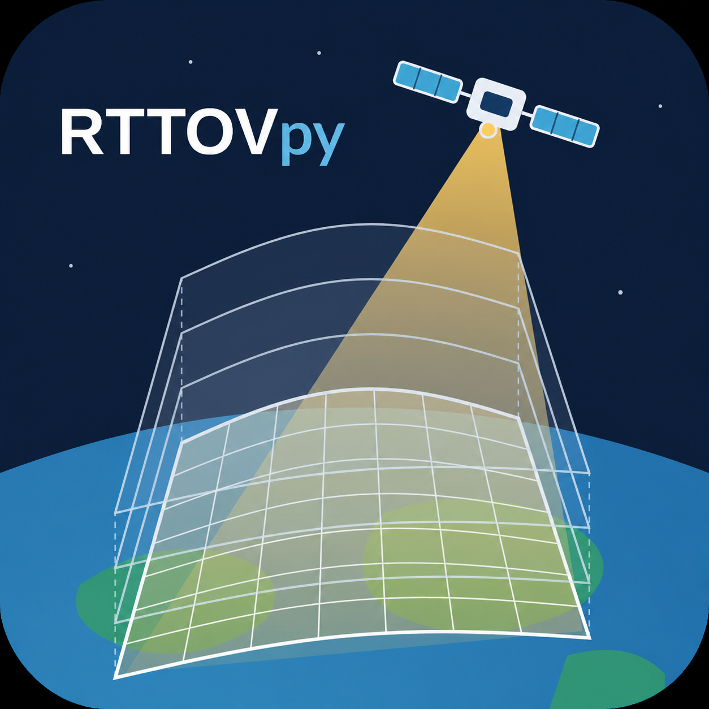

RTTOVpy Documentation
=====================

RTTOVpy is an application for generating RTTOV input profiles from ERA5 and
WRF model outputs, executing RTTOV forward simulations, and post-processing
the results into NetCDF files and satellite image products.

Features
--------

* Support for both **WRF** and **ERA5** workflows
* Automatic satellite viewing geometry from TLE data
* Historical TLE retrieval from **Space-Track**
* WRF-Chem dust/aerosol support
* Post-processing to NetCDF and publication-quality maps
* Verification against real satellite observations

.. toctree::
   :maxdepth: 2
   :caption: Getting Started

   overview
   installation
   quickstart

.. toctree::
   :maxdepth: 2
   :caption: User Guide

   workflow
   configuration_wrf
   output_files
   satellite_platforms
   satellite_readers
   notes_limitations

.. toctree::
   :maxdepth: 2
   :caption: Examples

   examples/era5/index
   examples/wrf/index